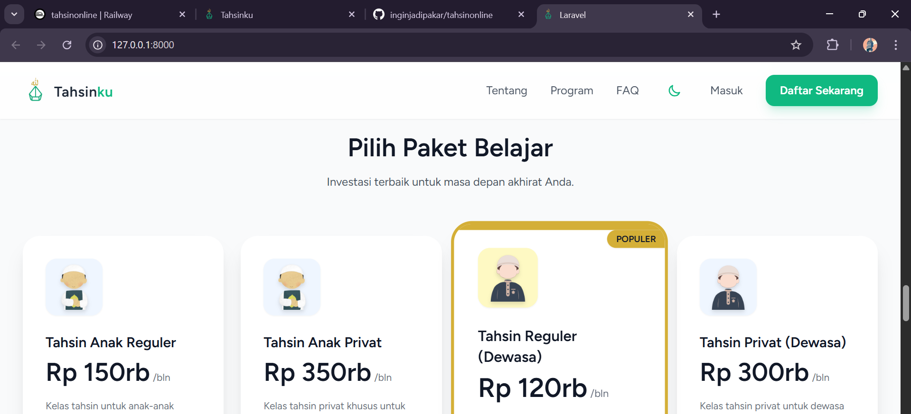

# 🎓 TahsinOnline - Platform Pembelajaran Tahsin Al-Qur'an

Platform pembelajaran Tahsin Al-Qur'an berbasis web yang dibangun dengan Laravel 12.

## 🚀 Quick Start (Deployment Gratis)

### Deploy ke Railway.app (Recommended - Gratis $5/bulan)

1. **Fork/Clone repository ini**
2. **Push ke GitHub** (pastikan repository public atau private dengan Railway access)
3. **Deploy ke Railway**:
   - Kunjungi [railway.app](https://railway.app)
   - Login dengan GitHub
   - New Project → Deploy from GitHub
   - Pilih repository `tahsionline`
   - Tambahkan MySQL database dari Railway dashboard
   - Configure environment variables (lihat `DEPLOYMENT.md`)

📖 **[Panduan Deployment Lengkap](./DEPLOYMENT.md)**

## 📋 Requirements

- PHP 8.2 atau lebih tinggi
- Composer
- Node.js & NPM
- MySQL 8.0+

## 🛠️ Local Development Setup

```bash
# Clone repository
git clone <YOUR_REPO_URL>
cd tahsionline

# Install dependencies
composer install
npm install

# Setup environment
cp .env.example .env
php artisan key:generate

# Configure database di .env
# DB_DATABASE=tahsinku
# DB_USERNAME=root
# DB_PASSWORD=

# Run migrations & seeders
php artisan migrate
php artisan db:seed

# Build assets
npm run build

# Start development server
php artisan serve
```

Aplikasi akan berjalan di `http://localhost:8000`

## ✨ Features

- 🔐 Autentikasi (Login/Register)
- 📚 Manajemen Program Tahsin
- 👥 Manajemen Kelas & Jadwal
- 💰 Sistem Pembayaran & Subscription
- 📊 Progress Tracking untuk Student
- 📖 Lesson Management
- 💳 Infak/Donasi
- 👨‍💼 Admin Dashboard
- 👨‍🎓 Student Portal

## 🏗️ Tech Stack

- **Framework**: Laravel 12
- **Frontend**: Laravel Breeze (Blade Templates)
- **Database**: MySQL
- **Build Tool**: Vite
- **Testing**: Pest PHP
- **Styling**: Tailwind CSS

## 📁 Struktur Project

```
tahsionline/
├── app/
│   ├── Http/Controllers/
│   │   ├── Admin/         # Admin controllers
│   │   ├── Student/       # Student controllers
│   │   └── Auth/          # Authentication
│   └── Models/            # Eloquent models
├── database/
│   ├── migrations/        # Database migrations
│   └── seeders/          # Database seeders
├── resources/
│   └── views/
│       ├── admin/         # Admin views
│       ├── student/       # Student views
│       └── components/    # Reusable components
└── routes/
    └── web.php           # Web routes
```

## 🔑 Default Users (After Seeding)

### Admin
- Email: `admin@tahsin.com`
- Password: `password`

### Student
- Email: `student@tahsin.com`
- Password: `password`

## 🌐 Deployment Options

### ✅ Railway.app (Recommended)
- Free tier: $5 kredit/bulan
- Auto-deploy dari GitHub
- Built-in MySQL database
- [Panduan Lengkap](./DEPLOYMENT.md)

### Alternative Platforms
- **Fly.io**: Free tier dengan Docker
- **Render.com**: Free tier dengan batasan
- **Vercel + PlanetScale**: Frontend di Vercel, DB di PlanetScale

## 🧪 Testing

```bash
# Run tests
php artisan test

# Run with coverage
php artisan test --coverage
```

## 📝 License

This project is open-source.

## 🤝 Contributing

Contributions, issues, and feature requests are welcome!

---

**Dibuat dengan ❤️ untuk pembelajaran Tahsin Al-Qur'an**
